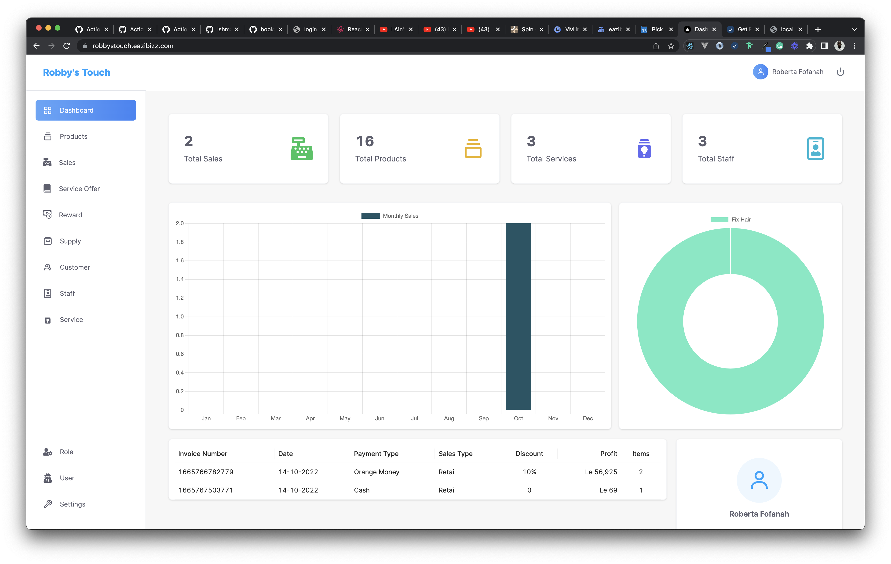

# Eazibiz (Easy Business, Easy Income)

Eazibiz for Goods and Services is an store management system that makes the day to day running of your business smoothly

#### Desktop Screenshot


## Built With

- Next.js

- Redux Toolkit

- Tailwinds css

- Ant UI

- React Icons


## Live Demo

<a href="https://api-demo.eazibizz.gom">Eazibiz</a>

## Getting Started

To get a local copy up and running follow these simple example steps.

- Clone this repository to your local machine
- git clone https://github.com/Soft-Magick/easy-biz-app.git
- cd easy-biz-app
- First, run the development server:

```bash
npm run dev
# or
yarn dev
```

## Authors

👤 **Ishmael Kargbo**

- GitHub: [@githubhandle](https://github.com/ishmaelkargbo)
- Twitter: [@twitterhandle](https://twitter.com/ishoKargbo)
- LinkedIn: [LinkedIn](https://linkedin.com/in/ishmael-kargbo-9a986a214)

## 🤝 Contributing

Contributions, issues, and feature requests are welcome!

Feel free to check the [issues page](https://github.com/Soft-Magick/easy-biz-app/issues/).

## Show your support

Give a ⭐️ if you like this project!